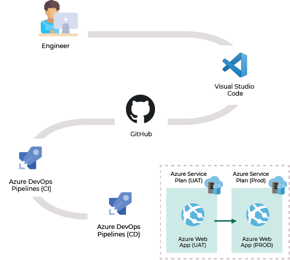

# react-azuredevops-buildonce-deploymany

This solution explains how to deploy a React application to multiple environments with a single build.

The solution uses Azure DevOps as CI/CD pipeline.  
The pipeline is defined in the *azure-pipelines.yml* file.

