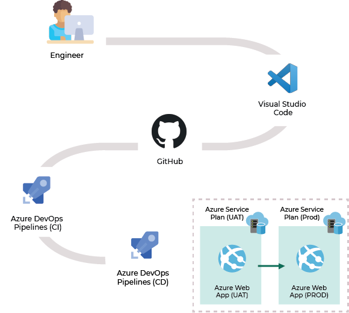

# How to deploy a React application to multiple environments using Azure Pipelines?

---

## Outline
* Title: How to deploy a React application to multiple environments?
* Keyword: React, CI/CD, Azure DevOps, Azure Pipelines
* Author: Thibault Ceulemans
* Publish Date: 
* Reader Persona: DevOps engineers, React developers

---

## Article

Do you have a React application that you want to deploy to any number of different environments?

Do you have multiple hosting environments in your system (dev, uat, prod, etc.) Each one with their own servers, configurations, hostnames, features, and so on?

If so, I have the solution for you. This is how to deploy to many enviornments while only building *once*.

### End-to-end solution

The end-to-end solution described in this article is described in the following diagram:



#### Azure

Azure is a complete cloud platform that can host your existing applications, streamline the development of new applications, and even enhance on-premises applications. Azure integrates the cloud services that you need in order to develop, test, deploy and manage your applications — while at the same time taking advantage of the efficiencies of cloud computing[^1].

#### Azure DevOps

Azure DevOps is a suite of development collaboration tools including high-performance pipelines, free private Git repositories, configurable Kanban boards, and extensive automated and continuous testing capabilities[^2].

#### Azure Pipelines

Azure Pipelines is a cloud service that allows you to automatically build and test your code project and make it available to other users[^3].


If you're new to Azure Pipelines, here is a link to an article that explain how to build, test and deploy your JavaScript/Node.js application: <a href="https://docs.microsoft.com/en-us/azure/devops/pipelines/languages/javascript?view=azure-devops" target="_blank">link</a>.


### What we did

To build and deploy our React applications, here are the main tasks we did in the past:
1. *Build pipeline* - Build the solution for a specific environment
2. *Build pipeline* - Copy the build artifact to the *Build.ArtifactStagingDirectory* folder (each environment has its own sub-folder)
3. *Release pipeline* - Pick the right build artifact and deploy it to the right environment

Our *azure-pipelines.yml* (build pipeline) file looked something like this:
```yaml
...
- task: Npm@1
  displayName: '[DEV] npm build'
  inputs:
    command: 'custom'
    workingDir: '$(workingDirectory)'
    customCommand: 'run builddev'
- publish: $(workingDirectory)/build
  artifact: frontenddev
  
- task: Npm@1
  displayName: '[UAT] npm build'
  inputs:
    command: 'custom'
    workingDir: '$(workingDirectory)'
    customCommand: 'run builduat'
- publish: $(workingDirectory)/build
  artifact: frontenduat
  
- task: Npm@1
  displayName: '[PROD] npm build'
  inputs:
    command: 'custom'
    workingDir: '$(workingDirectory)'
    customCommand: 'run build'
- publish: $(workingDirectory)/build
  artifact: frontendprod

...
```

When we wanted to deploy the application, we had to pick the right sub-folder in the artifacts. Here is the deployment task (release pipeline) for the UAT environment:

```yaml
- download: current
  artifact: frontenduat
- task: AzureRmWebAppDeployment@4
  displayName: 'Azure App Service Deploy: Front-end'
  inputs:
    azureSubscription: 'Azure React Build Once Deploy Many'
    WebAppName: '$(Azure.WebAppName)'
    packageForLinux: '$(Pipeline.Workspace)/frontenduat'
    enableCustomDeployment: true
```

Regarding the solution, for every environment we had a specific task in the *package.json* file:

```json
"scripts": {
    "start": "react-scripts start",
    "build": "set REACT_APP_ENV=production && react-scripts build",
    "builduat": "set REACT_APP_ENV=uat && react-scripts build",
    "builddev": "set REACT_APP_ENV=dev && react-scripts build",
    "test": "react-scripts test",
    "eject": "react-scripts eject"
}
```

The *REACT_APP_ENV* environment variable[^4] was used in the code to check the application environment. Once the application knows the environment, it can act accordingly.

```javascript
let appBaseUrl = "http://localhost:3000";
let remoteServiceBaseUrl="http://localhost:21021/";

const env = process.env.REACT_APP_ENV && process.env.REACT_APP_ENV.trim();

if (env === "uat") {
  appBaseUrl = "https://abc-uat.azurewebsites.net/";
  remoteServiceBaseUrl = "https://abc-uat.azurewebsites.net/webproxy";
} else if(env === "production") {
  appBaseUrl = "https://def.azurewebsites.net/";
  remoteServiceBaseUrl = "https://def.azurewebsites.net/webproxy";
} else if(env === "dev") {
  appBaseUrl = "https://def-dev.azurewebsites.net/";
  remoteServiceBaseUrl = "https://def-dev.azurewebsites.net/webproxy";
}
...
```

This technique has the following disadvantages:
* Many environment-specific tasks in the build process
* A lot of artifacts to store
* The duration of the build stage is high

### What we do

Coming from a back-end environment where we are used to the "Build once, deploy many" approach, I want to apply the same path for a front-end application.  
The goal is to remove environment-specific tasks in the build process. It means:
1. Less artifacts to store
2. Decrease the build stage duration

#### "Build once, deploy many" approach

Rather than compiling and rebuilding your application for every environment you plan to deploy to, build your application binary only once, and then migrate the same build artifact to the different environments. By building once and deploying that binary many times, you have eliminated half of the aforementioned deploy time variables that could lead to errors.

#### The issue

React embed all the environment variables in the generated files during the build time[^4]. It means that the environments variables' values are hidden in the "/build/static/js/main.*.js" files.


#### The solution

Instead of inserting (during the build) the value of the environment variables in the generated file, we insert some well-defined tags. These tags will then be replaced at deploy time accordingly by the correct values.

The solution is decomposed into 5 big steps:
1. Tokenisation of the environment variables in the solution files
2. *Build pipeline* - Build the solution
3. *Release pipeline* - Download the build artifact
4. *Release pipeline* - Replace the tags in the generated files 
5. *Release pipeline* - Deploy the application to Azure App Service

The 3 last steps have to be done for each environment.

##### 1. Tokenisation of the environment variables

The *.env.production* file now inserts tags into the generated files so the system can easily identify where the files need to be updated. Each variable has the same tag delimiter, in our case we picked "[!...!]".  
Exemple:

```javascript
REACT_APP_APP_BASE_URL="[!Website.Url!]"
REACT_APP_VAR1="[!Variable1!]"
REACT_APP_VAR2="[!Variable2!]"
```

##### 2. Build the solution

The solution is built using the classic commands:
1. *npm install*
2. *npm build*

Once it's built, the system needs to publish the generated build files to the pipeline artifacts.

Here is how the *azure-pipelines.yml* file looks like for the Build stage:

```yaml
- stage: 'Build'
  displayName: 'Build and package the solution'
  jobs:
  - job: Frontend
    pool:
      vmImage: 'ubuntu-latest'
    variables:
      workingDirectory : '.'
    steps:
    - task: Npm@1
      displayName: 'npm install'
      inputs:
        command: 'install'
        workingDir: '$(workingDirectory)'
    - task: Npm@1
      displayName: 'npm build'
      inputs:
        command: 'custom'
        workingDir: '$(workingDirectory)'
        customCommand: 'run build'
    - publish: $(workingDirectory)/build
      artifact: frontend
```

##### 3. Download the build artifact

The first step in the release pipeline is to download the artifact created during the build pipeline.

```yaml
- download: current
  artifact: frontend
```


##### 4. Replace the tags in the generated files

Now that we have the build artifact, we can replace the tags in the generated files.

To replace the tags in the generated files, we use the <a href="https://docs.microsoft.com/en-us/azure/devops/pipelines/tasks/utility/powershell?view=azure-devops" target="_blank">PowerShell task</a> provided by Azure Pipelines. This task enables us to execute any PowerShell script against our files. That's the perfect fit for our requirements !
 
The script takes every files in the "/build/static/js/" folder that starts with "main.*" and checks if it contains any tokenerized variables in it. If it finds a match, it replaces the tokenerized variable with the right value. The value are stored in the <a href="https://docs.microsoft.com/en-us/azure/devops/pipelines/process/variables?view=azure-devops&tabs=yaml%2Cbatch" target="_blank">Azure Pipelines variable</a>. This variables are accessible as <a href="https://docs.microsoft.com/en-us/powershell/module/microsoft.powershell.core/about/about_environment_variables?view=powershell-6" target="_blank">Environement Variables</a> (*env:*).
 
Here is the PowerShell script:

 ```powershell
$pattern = "\[!(.*?)!\]"
$envs = Get-childItem env:
Get-ChildItem -Path $path -Recurse -Filter "main.*" -File | 
Foreach-Object {
    $content = Get-Content $_.FullName
    $results = $content | Select-String $pattern -AllMatches
    
    foreach ($tag in $results.Matches.Value) {
         $cleanTag = $tag.replace('[!', '').replace('!]', '').replace('.', '_').ToUpper()
         write-host $cleanTag
         $data = ($envs|where{$_.Name -like $cleanTag}).Value
         if ([string]::IsNullOrEmpty($data)) {
           Write-Host  "##vso[task.LogIssue type=error;]$cleanTag was not initialized"
           exit 1
         }
         (Get-Content $_.FullName).replace($tag, ($envs|where{$_.Name -like $cleanTag}).Value) | Set-Content $_.FullName
    }
}
```

##### 5. Deploy the application

The final step is to deploy the application to an Azure App Service:

```yaml
- task: AzureRmWebAppDeployment@4
  displayName: 'Azure App Service Deploy - frontend'
  inputs:
    azureSubscription: 'Azure React Build Once Deploy Many'
    WebAppName: '$(Azure.WebAppName)'
    packageForLinux: '$(Pipeline.Workspace)/frontend'
    enableCustomDeployment: true
```

### Conclusion

With this solution we make our build pipeline lighter. It means:
1. Decrease of the build duration;
2. Less artifacts to store;
3. No additional code required in our React app.


You can find the *azure-pipelines.yml* file that describes the full pipeline (build + release to 2 different environments) here: <a href="https://github.com/Thibaultce/react-azuredevops-buildonce-deploymany/blob/master/azure-pipelines.yml" target="_blank">link</a>.


[^1]: Source: [Azure documentation](https://docs.microsoft.com/en-us/azure/guides/developer/azure-developer-guide)
[^2]: Source: [Azure DevOps documentation](https://docs.microsoft.com/en-in/azure/devops/?view=azure-devops)
[^3]: Source: [Azure Pipelines documentation](https://docs.microsoft.com/en-us/azure/devops/pipelines/get-started/what-is-azure-pipelines?view=azure-devops)
[^4]: Source: [Adding Custom Environment Variables](https://facebook.github.io/create-react-app/docs/adding-custom-environment-variables)
